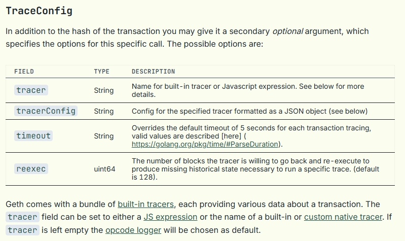

> 请在上边的 timezone 添加你的当地时区(UTC)，这会有助于你的打卡状态的自动化更新，如果没有添加，默认为北京时间 UTC+8 时区


# Rhyne Hsu

1. 自我介绍
   - [Rhyne Hsu](https://www.linkedin.com/in/yuanzhen-hsu) / [Sasaki](https://x.com/AntiSasaki)，一个兴趣使然的web3爱好者，希望把自己的技术锻炼得更solid！
3. 你认为你会完成本次残酷学习吗？
   - 会滴！🐛🐛🐛
4. 你的联系方式（推荐 Telegram）
   - TG：@AntiSasaki

## Notes

<!-- Content_START -->

### 2025.06.16
---
#### 📗Basic
- 2014年测试网上线，2015年主网上线
- $1\ eth = 10^{18}\ Wei = 10^9\ Gwei$
- 由比特币的UTXO模型转变为账户模型，可以减少空间消耗，账户以 *modified Merkle Patricia Trie (MPT)* 存储（一种能提供根hash证明的压缩前缀树）
#### 📗Architecture
> The main challenge a consensus protocol aims to solve is building a reliable distributed system on top of unreliable infrastructure.

由共识层和执行层两侧组成
- 共识层负责PoS共识
- 执行层负责实际的链上状态更新
- 共识层和执行层执行通过Engine APIs沟通

**共识层CL**，即信标链 (Beacon Chain)
- 09/15/2022 The Paris hard fork (**The Merge**)
	- 由一个规定的 *TTD (Total Terminal Difficulty)* 触发，一旦有区块的TD (Total Difficulty) 达到TTD，就会终止PoW区块的生成
	- 在PoW阶段，共识是基于最重链，即有最多的 TD 的链
	- 一般的协议更新的trigger都是block height，而这里采用TTD trigger，原因是：如果采用block height，恶意节点可以用小部分算力拓展非最重链来抢先达到规定的block height从而终止所有PoW区块的生成，实现攻击；而如果用TTD trigger则不会受到这样的攻击
	- **Bellatrix Update** 是为The Merge做准备的共识层更新，它规定了CL和EL客户端必须遵循下面的结构。CL客户端必须包含Bellatrix更新；EL客户端必须包含Paris更新并暴露 Engine API 接口
		
	- **Paris Update** 则是相应的执行层更新
	- [reference](https://etherworld.co/2022/07/20/what-do-bellatrix-paris-ttd-mean-in-ethereum-merge-upgrade/)
- 以太坊的共识机制 (**Gasper**) 实际上由两种共识机制耦合而成：**LMD GHOST** & **Casper FFG**
- Validators
	- 每个验证者最多质押32 ETH，更多质押并不会增加其权重。超过32 ETH的，需要运行更多验证者来实现（一个验证者客户端可以管理多个验证者）
	- 同时，要成为验证者，要求的最少质押也是 32 ETH
- Slots and Epochs
	- **12秒**一个slot，**32 slots**一个epoch，即约 6.4 分钟一个epoch
	- 这要求验证者节点在时间上要基本同步
	- 一个slot是产生区块的一次**机会**，也就是说一个slot不一定会产生一个区块
	- 网络中所有validator在每个epoch中会被均分到各个slots中，每个slot内部再划分committee
	- 每个slot会根据 RANDAO 发射的随机数，伪随机地选出该slot的committees（每个committee至少128个验证者）
	- 每个slot只有对应的committees可以进行投票见证
	- 一个slot中可以有多个commitees（一般都有多个）
	- 同时选出一个validator，由他提出新区块提案，其他validator则对其进行见证 (attest)
	- attestation会在validator之间广播，validator彼此监督是否有人
	- slot中投票后，该区块得到的只是slot级别的通过，并没有被最终确认
	- 因为在每个epoch的最后还需要全网 2/3 的总stake进行投票
- Beacon：由一个名叫 **RANDAO** 的伪随机过程发射随机数，来决定每个epoch中的每个slot的committees，这个RANDAO就像整条链的信标，这就是 *Beacon Chain* 名字的由来

**执行层EL**

#### 📋TODOs
- [ ] 整理所有历史更新的{名称、时间、主要内容}
- [ ] LMD GHOST
- [ ] Casper FFG

> END_OF_TODAY [BOOKMARK](https://epf.wiki/#/wiki/CL/overview?id=blobs)

### 2025.06.17
---
#### 📗Consensus
**Blobs**：[EIP-4844](https://eips.ethereum.org/EIPS/eip-4844) 引入，是Cancun硬分叉的一部分。允许每个区块携带3-6个 Blob sidecars，相当于为网络添加了一个数据层 (*data accessibility layer*)
- 每个Blob的保留期限是 4096 epochs，过期即会drop掉
- KZG commitment

**Finalization**：
- validator有两种投票：LMD GHOST 投票给普通区块，Casper FFG投票给checkpoints
- validator只能给自己对应的slot投LMD GHOST票，而投票checkpoints时，所有validator都可以投Casper FFG票，这个是一个epoch中随时可以投的
- 并且validator也可以延迟给slot投票，不一定非要在自己的slot立即投票
- 当然，立即投票的奖励是最高的，延迟投票会减少奖励
- checkpoint是每个epoch的第一个区块
- 每个 Casper FFG 投票，需要指定 
	1. 其源checkpoint：以往epoch的checkpoint
	2. 目标checkpoint：当前epoch的checkpoint
- checkpoint获得超 2/3 的绝对多数投票Casper FFG后，将会被 *justified*
- checkpoint被 *justified* 之后，其前一个checkpoint才会被 *finalized*
- 也就是说一个checkpoint被finalized大概需要2个epoch的时间（12.8分钟）

**Slashable Offenses**
- Double Proposal
- LMD GHOST Double Vote
- FFG Surround vote
- FFG Double Vote

**validator** 初始需要32个ETH才能激活，当其质押金额少于16ETH时会失活
- 需要服务2048个epoch之后才能主动退出
- 提出退出后，需要4个epoch的冷却期才能退出，用于留给slash的时间窗口
- 同样的，提起激活前也需要有4个epoch的窗口期
- 退出后，未被slash的在 $2^8$ epoch（27h）之后可以提款；而被slash的则需要 $2^13$ epoch （36天）才能退款
- 每个epoch能激活和失活的validator数量有一个规定的阈值
	

> <END_OF_TODAY> [BOOKMARK](https://epf.wiki/#/wiki/CL/cl-architecture)

### 2025.06.18
---
#### 📗Consensus Layer
- LMD GHOST 提供 liveness，Casper FFG 提供 finality
> In essence, LMD GHOST keeps the chain moving forward, while Casper FFG ensures stability by finalizing blocks.

- **CAP Theorem**：一个分布式系统不可能同时满足 Consistency, Availability, Partition tolerance
- 一个新区块是如何产生的
	1. 当前slot的block proposer的EL client执行`create block`指令
	2. EL获取mempool中的交易
	3. EL打包交易并执行，生成新区块的hash
	4. CL客户端将交易集合和区块hash放入beacon block（CL的区块），并在网络中广播
	5. 其他validator收到广播区块
	6. 将交易作为 *execution payload* 发送到EL，执行交易并生成hash
	7. 验证hash后，将该区块添加到CL中，完成见证（attest）并广播 *attestation*
- 一个新区块的心路历程：proposed -> attested -> justified -> finalized
- Consensus Client的技术栈
	- libp2p：p2p协议
	- discv5：peer discovery
	- libp2p-noise：加密
	- [SSZ](https://ethereum.org/en/developers/docs/data-structures-and-encoding/ssz/) (Simple SerialiZe)：取代了 RLP的新的编码/序列化算法
	> [RLP](https://ethereum.org/en/developers/docs/data-structures-and-encoding/rlp/) (Recursive-Length Prefix)：曾是以太坊EL的序列化算法

	- (snappy)[https://en.wikipedia.org/wiki/Snappy_(compression)]：压缩算法，保证合理的压缩比的前提下优先压缩/解压速度
- 共识层规范 Consensus Layer *Specification*：[Pyspec](https://github.com/ethereum/consensus-specs) 是为共识层开发者提供的执行规范
- Clients
	- Consensus Client: 运行以太坊PoS共识算法
	- Execution Client: 参与交易的验证和广播，执行状态转移
	- Validator Client: 进行 attest 和 propose 新区块（validator client时 consensus client的一种可选的附加组件）

> <END_OF_TODAY> [BOOKMARK](https://epf.wiki/#/wiki/CL/cl-clients)

### 2025.06.19
---
目前的CL Client种类

|Client|Language|Developer|Status|
|---|---|---|---|
|[Lighthouse](https://github.com/sigp/lighthouse)|Rust|Sigma Prime|Production|
|[Lodestar](https://github.com/ChainSafe/lodestar)|TypeScript|ChainSafe|Production|
|[Nimbus](https://github.com/status-im/nimbus-eth2)|Nim|Status|Production|
|[Prysm](https://github.com/prysmaticlabs/prysm)|Go|Prysmatic Labs|Production|
|[Teku](https://github.com/ConsenSys/teku)|Java|ConsenSys|Production|
|[Grandine](https://github.com/grandinetech/grandine)|Rust|Grandine Developers|Production|
|[Caplin](https://github.com/ledgerwatch/erigon)|Go|Erigon|Development|
|[LambdaClass](https://github.com/lambdaclass/lambda_ethereum_consensus)|Elixir|LambdaClass|Development|

客户端种类的**多样性**对一个网络的安全和鲁棒至关重要，因为单一客户端有出现问题的可能，如果网络中2/3的节点使用单一客户端，一旦该客户端软件出问题，网络就会崩溃。目前最主流的是 Lighthouse 和 Prysm

#### 📗SSZ
SSZ (Simple SerialiZation): 是专为以太坊设计的 1. 序列化 和 2. Merkleization 方案

- 为什么要序列化：将数据结构或对象转换为**可存储或可传输格式**，以便 
	1. 数据持久化 
	2. 网络传输
	3. 跨语言/平台兼容：为跨实现的节点（不同语言）提供统一通信格式
	4. 存储与效率优化：原始对象可能包含很多冗余信息，序列化可以压缩为精简格式，节省空间
	5. 哈希和签名：数据序列化为字节后，便于进行哈希、加密、签名等操作
- 无符号整数编码：Little-Endian Formt，低位byte排在地址前面（最低位），如`0x12345678` 编码为 `[0x78, 0x56, 0x34, 0x12]`
```python
class Example
    id: uint64,
    bytes: List[uint8, 64]
    next: uint64
```
```
# serialize(my_example)
#
# Note: this is a single byte-array split over four lines for readability.
[
  42, 0, 0, 0,  # The little-endian encoding of `id`, 42.
  12, 0, 0, 0,  # The "offset" that indicates where the variable-length value of `bytes` starts (little-endian 12).
  43, 0, 0, 0,  # The little-endian encoding of `next`, 43.
  0, 1, 2       # The value of the `bytes` field.
]
```

> <END_OF_TODAY> [BOOKMARK](https://epf.wiki/#/wiki/CL/SSZ)

### 2025.06.20
---
- SSZ具体各种类型的数据的序列化方法： https://epf.wiki/#/wiki/CL/SSZ
- Merkleization: 指将序列化后的数据构造为Merkle树并得到其根hash的过程
- 弱主观性 *weak subjectivity*
	- 客观：信息的正确性完全可验证
	- 主观：信息的正确性并不能完全可验证
- *Full Syncing*：指PoW时期，所有合法区块都一定可以完美追溯到Genesis块
	- 然后转入PoS之后，由于finality来自于CL而非EL
	- 要断言一个finalized的checkpoint的正确性，必须要额外的验证
- validator退出CL之后，将不能再为未来的区块投票，但仍可以对过去的区块重新投票
- Beacon block syncing 和 Execution block Syncing 的区别
	1. Beacon chain的syncing是反方向的
	2. Beacon chain的信任锚点是主观的：Beacon chain的同步目标是一个“最终确定”区块，但它不能被完全客观验证，只能部分验证其正确性。因此，这个检查点需要通过**链外途径（out-of-band）**获取
	3. 弱主观性周期与乐观导入：在 Execution 层尚未完成同步时，Beacon 链会先 **乐观导入（optimistically import）** 新块，但暂不验证其 Execution Payload
- **Weak Subjectivity Sync** 步骤
	1. Obtain a weak subjectivity checkpoint out-of-band （因为p2p层中的peer是不可信的）
	2. Backfill blocks all the way back to genesis from the weak subjectivity checkpoint
	3. Update the target header for the execution chain
	4. Optimistically follow the head of the chain and continuously update the target header for the execution chain
	5. Once the EL is synced, then mark the CL slots as verified post-verification. The node may now be considered fully synced

> <END_OF_TODAY>

### 2025.06.23
---
#### 📗Geth
> 最popular的 EL 客户端</br>
[source code](https://github.com/ethereum/go-ethereum.git)</br>
[Geth 源码系列 I：Geth 整体架构](https://forum.lxdao.io/t/geth-i-geth/2856)

执行层的六个部分
1. EVM：状态机的状态转移函数。负责执行交易，交易执行也是修改状态数的唯一方式
2. 存储
3. mempool
4. p2p网络
5. RPC服务：提供访问节点的能力，如用户向节点发送请求、CL和EL之间的交互
6. Blockchain

EL node 的三种可能状态及需要做的事
1. 新加入网络：需要通过p2p网络获取区块和状态数据
	- Full Sync：从 genesis block 逐个下载、验证、重建状态数据库
	- Snap Sync：直接下载最新 checkpoint 的状态数据和以后的区块数据
2. 已同步到最新状态，非 proposer：
	- CL 持续通过 Engine API 从共识层获取到当前最新产出的区块
	- CL client 将交易作为 *execution payload* 发送到EL
	- EL 执行交易完成状态转移，并生成hash验证区块
	- 更新状态数据库、本地区块链
	- 将该区块添加到CL中，完成见证（attest）并广播 *attestation*
3. 已同步到最新状态，选为 proposer：
	- CL驱动EL client执行`create block`指令
	- EL获取mempool中的交易
	- EL打包交易并执行，生成新区块的hash
	- CL客户端将交易集合和区块hash放入beacon block（CL的区块），并在网络中广播
- `eth/backend.go` Ethereum核心抽象
``` go
type Ethereum struct {
	config         *ethconfig.Config  // 以太坊配置，包括链配置
	txPool         *txpool.TxPool  // 交易池，用户的交易提交之后先到交易池
	localTxTracker *locals.TxTracker  // 用于跟踪和管理本地交易（local transactions）
	blockchain     *core.BlockChain  // 区块链结构
	handler *handler  // 是以太坊节点的网络层核心组件，负责处理所有与其他节点的通信，包括区块同步、交易广播和接收，以及管理对等节点连接
	discmix *enode.FairMix  // 负责节点发现和节点源管理
	chainDb ethdb.Database  // 负责区块链数据的持久化存储
	eventMux       *event.TypeMux  // 负责处理各种内部事件的发布和订阅
	engine         consensus.Engine  // 共识引擎
	accountManager *accounts.Manager  // 管理用户账户和密钥
	filterMaps      *filtermaps.FilterMaps  // 管理日志过滤器和区块过滤器
	closeFilterMaps chan chan struct{}  // 用于安全关闭 filterMaps 的通道，确保在节点关闭时正确清理资源
	APIBackend *EthAPIBackend  // 为 RPC API 提供后端支持
	miner    *miner.Miner  // 在 PoS 下，与共识引擎协作验证区块
	gasPrice *big.Int  // 节点接受的最低gas价格
	networkID     uint64  // 网络 ID
	netRPCService *ethapi.NetAPI  // 提供网络相关的 RPC 服务，允许通过 RPC 查询网络状态
	p2pServer *p2p.Server  // 管理P2P网络连接，处理节点发现和连接建立并提供底层网络传输功能
	lock sync.RWMutex  // 保护可变字段的并发访问
	shutdownTracker *shutdowncheck.ShutdownTracker  // 跟踪节点是否正常关闭，在异常关闭后帮助恢复
}
```
- geth 节点启动入口：`cmd/geth/main.go`

- 实战教程: [goethereumbook](https://goethereumbook.org/en/)

### 2025.06.24
---
#### 📗Effective Go
今天学习 [Effective Go](https://go.dev/doc/effective_go#commentary)，为 Geth 实战打好语言基础

#### 📗Basic
- go有一个default的官方指定的程序化的格式调整工具 `gofmt`，每次 `CTRL + s` 保存的时候会自动调整格式为理想格式，主要优化缩进和空格
- 命名惯例
	- 变量、函数都用驼峰命名法，首字母小写
	- 要export的函数，首字母大写
- 非常适用于高性能分布式系统，提供了很多并行的支持，适合开发游戏服务端等
- 第一行为`package <pkg_name>`，指定该文件属于哪个包
	- 每个Go程序都必须有一个main包
	- 按照约定，包名与导入路径的最后一个元素一致。例如，"math/rand" 包中的源码均以 package rand 语句开始
- import 来引入包
	- Go中，如果被import的包没有被调用，编译器是会报错的
	- 也可以用分组的形式导入
	``` go
	import (
		"fmt"
		"math"
	)
	```
- 大写字母开头的函数、变量等，是可以导出包外的，相当于public；小写开头的则只在包内可见，相当于protected
	- 所以说调用包的方法和变量时，其名字一定是大写打头的
- **不需要分号结尾**，同python
- 变量都由关键字`var`声明
	- 可以在变量名后显式地声明变量类型 `var a string = "Go"`
	- 也可以用 `:=` 来直接声明变量
	- go中的自动类型推断是在编译时进行的，而python是在运行时进行的
		- 函数外的每个语句都必须以关键字开始（var、func 等），因此`:=`结构不能在函数外使用。
	- 可以同时在一行为多个不同类型的变量赋值：`var c, python, java = true, false, "no!"`
- `const` 用来声明常量，有了const就不用再var了
	``` go
	const (
		a = iota  // 0
		b         // 1
		c         // 2
		d = 5     // 5
		e         // 5
	)
	```
	- `iota` 从0开始，每过一行自增1，到下一个硬编码的变量时中止
	- 中止之后，未被赋值的变量默认等于上一个变量的值
- 可以一行声明和初始化多个变量
- `func`来声明函数：`func function_name( [parameter list] ) [return_types]`
	- 函数可以返回任意数量的返回值
	- 可以在函数定义中声明返回值的名字 `func split(sum int) (x, y int) {}`
- go中也有类似c的指针，但是没有指针运算
	- 结构体的指针也可以直接用点号 `.` 来取成员
- go没有类，但是可以为类型定义方法
	- `func (s *Stack) Push(item int)` 函数名之前指定类名和类指针变量名，来为类型实现方法
- 局部变量在声明之后必须被用到，否则会报编译错误
- 可以同时赋值 `a, b = b, a`
- `make()`只用于创建三种对象：channel, slice, map
	- make返回对象的引用，new返回指针
	- `make([]int, len)` 来创建一个长度为len的数组（自动初始化为0）
- go主要就是玩slice
- go没有tuple

#### 📗Syntax
- go中没有前置自增运算符 (`++i`)，但是有后置的 (`i++`)
	- 不过go中的自增是没有返回值的，也就是不能用自增表达式给别人赋值
- if语句的条件不需要用括号括起来，类似于rust
- 和 for 一样，if 语句可以在条件表达式前执行一个简短语句。 `if v := math.Pow(x, n); v < lim {}`
	- 在这个简短语句中声明的变量在整个if和else语句块中都可见
- for语句条件与c类似，只是不用括号
	- `for idx, char := range str {}` 用`:=`
	- range返回的是一个**enumerate**，如果第一个值默认被赋值为idx
	- 所以想要实际的值，而不是index的话，需要用`_`接收掉index：`for _, val := range arr {}`
- for后面可以只包括条件语句，这时for与c中的while相等 `for i < 100 {}`
- 也可以什么都不带，这时等于rust中的loop `for {}`
- `defer` 推迟，go特有的关键字，表示把后面的语句放在当前函数返回之后再执行
	- 推迟调用的函数被压入栈中，调用时先进后出
	- 用来关闭文件、释放锁很方便 
	``` go
	file, _ = os.Open(path)
	defer func(){file.Close()}
	```
- 定义函数时，在`func`和函数名之间可以有一个接收者Receiver：`func (h IntHeap) Len() int`
	- 接收者可以是值接收者(value receiver)或指针接收者(pointer receiver)
	- 值接收者时，函数中h是原来的h的一个clone，在函数中，如果有人在其他地方改了h，不会影响这个函数，适合不改变该对象的值的函数
	- 指针接收者时，函数中h就是原来的h的指针，对`*h`的修改会更改原本的值

> <END_OF_TODAY>


### 2025.06.25
#### 📗Type
- `int`的大小是64位（64位系统），同int64
- 变量类型都是出现在变量名之后的
	- 多个相同的类型只需要显式声明最后一个 `func add(x, y int) int {}`
- 类型不同的变量之间不能进行运算，即使是int64和int之间也不能，也就是说**没有隐式类型转换**，需要进行显式类型转换才能运算 `int64(val)`
- `nil`, `true`, `false`都不是关键字，而是预定义的标识符（变量）
- `nil`代表各个类型的零值
- `rune` 是go特有的一个类型，占4个byte，32bits，表示一个unicode字符（是int32的别名）
- `byte`是uint8的别名
- **结构体**
	- 用花括号初始化`v1 = Vertex{1, 2}`
- **信道channel**
	- 定义：`ch := make(chan int, 100)` 其中第二个参数为信道缓冲容量，缓冲区填满后，向其发送数据才会阻塞
	- buffer的意思是，ch里可以先暂存n个，向有buffer的ch里写可以直接往下运行。缺省情况下ch里是不能暂存的，没人读就会阻塞
	- `ch <- a` 将a发送至信道
	- `b := <- ch` 将信道中的值输出给b。如果信道中没有值或者信道已关闭，则输出为false
	- `close(ch)` 来关闭一个信道，一般用完可以不管，不用close
	- `for i := range ch {}` 来不断从信道接收值，直到信道关闭
	- 信道在另一端还没有准备好的时候会阻塞，这样就可以使不同的go程同步
- `any`：变量可以被声明为any类型，这在定义接口时很方便。虽然它可能是任意类型，但其实际存的数据是有一个固定的类型的
	- `x.(int)` 这是一个type assertion，用于检查any变量实际存储的类型，返回两个值：`value, ok`
	- 将any类型的变量赋值给别人时，也需要做type assertion
- **interface**：是一种特殊的类型
	- 定义新的接口：
	``` go
	type Block interface {
	    BlockSize() int
	    Encrypt(dst, src []byte)
	    Decrypt(dst, src []byte)
	}
	```
	- `str, ok := value.(Stringer)` 来判断一个对象是否实现了该接口

#### 📗Data Structure
- go中没有内置的stack结构，只能用切片来模拟
	- `s = s[:len(s) - 1]` 来模拟pop
##### Array
- array作为函数参数时，传的是一个copy，而非指针
- array的长度是其类型的一部分，即 `[5]int` 和 `[10]int` 不是同一类型
##### Slice
- `var a1 [5]int`和`a2 := make([]int, 5)`是不一样的
	- 前者创建的是一个固定大小的array（只有`[ ]`里面有具体的数字时，才是一个定长array）
	- 后者是一个slice，类似于vector，其大小是可伸缩的
- 切片`var slice []int`，类似于python的list，或者说可变长数组
- 通过`append`方法来添加新的元素 `numbers = append(numbers, 0)`
	- 因为有append，实际上也可以等于是一个vec
- slice 底层维护三个变量 1. 一个数组  2. 一个length（最大索引值） 3. 一个capacity
	- 而slice变量本身则是这个底层数组的一个引用
	- 当一个slice赋值给另一个slice时，这两个slice都将指向同一个底层的数组
	- 最大索引值有时候变得比数组长度小，但底层数组的值并不会消失掉，仍然在那
- 切片是数组的引用，通过切片会改变底层数组的值
	- 所以slice作为函数参数时，函数内部对slice的修改在外部也可见，行为类似传了变量的指针
- 切片的长度就是它所包含的元素个数 `len(s)`
- 切片的容量是从它的第一个元素开始数，到其底层数组元素末尾的个数。
	- `cap(s)`
- 拼接两个切片：`append(s1, s2...)` 其中`...`表示unpacking，把一个collection拆分成单个单个的元素
- go的数组/切片没有原生的remove方法，可以用 `s = s[:i] + s[i + 2:]` 来实现移除中间元素
	- 切片的话：`slice = append(slice[:i], slice[i+2:]...)`
	- 这个操作的复杂度是 $O(n)$ 的，尽量少用
##### map
- `myMap := make(map[string]string)` 来创建一个空的map
- `myMap[key] = val` 来直接插入键值对，类似于python
- `myMap[key]` 来获取键对应的值，它其实返回两个值：`value, exists` 其中第二个值是一个bool，表示该key原本是否存在
- 如果键不存在，则对应返回的值为值的零值
	- 虽然返回零值，但这并不会在map中插入这个key
- `delete(map, "key")` 来删除一个键值对
##### string
- string的本质是immutable的byte数组
- 可以用`range`关键字来**遍历字符串中的字符** `for idx, char := range str {}`
- `chars := []bytes(str)` 用类型转换的方式可以将string转换为bytes slice
- go的string其实很类似于python，可以很方便地实现`+`运算，如`s = "^" + s + "$"`
##### Heap
> [official docs](https://pkg.go.dev/container/heap)

- import "container/heap"
- `type <your_heap> []int` 基于某种已有类型，定义自己的heap类型
- 必须自己实现接口：
	- Len: `func (h <your_heap>) Len() int`
	- Less: `func (h <your_heap>) Less(i, j int) bool`
	- Swap: `func (h <your_heap>) Swap(i, j int)`
	- Push: `func (h *<your_heap>) Push(x any)`
	- Pop: `func (h *<your_heap>) Pop() any`
	> Push and Pop use pointer receivers because they modify the slice's length, not just its contents.

- 是一个基于自定义Less规则的小堆
- 初始化：`heap = &<your_heap>{vals}`
- 注意了，接收者为指针时，函数的调用方式其实类似于静态成员函数：`heap.Push(h, x)`
- 对于不改变值的函数，也就是接收者为值时，可以直接用类似对象方法的方式调用 `h.Len()`
- `heap.Pop(h)`之后记得做type assertion，否则不能用
- 没有Peek方法，只能通过取底层数组的0元素来实现peek：`top := (*h)[0]`

> <END_OF_TODAY>

### 2025.06.26
#### 📗Geth
> [goethereumbook](https://goethereumbook.org/en/)

需要 `go mod` 才能丝滑地 import github
- `go mod init module_name`
- `go get github.com/ethereum/go-ethereum@latest`

#### 📗Basic
- ETH 的数额一定是个 `big.Int`
- data域中每一个字段都必须是 32 bytes 右对齐
	- data域的第一个字段是调用的函数的 `methodID`
	- `methodID` 是函数签名的 Keccak-256 hash 的前 4 bytes
	``` go
	transferFnSignature := []byte("transfer(address,uint256)")
	hash := sha3.NewLegacyKeccak256()
	hash.Write(transferFnSignature)
	methodID := hash.Sum(nil)[:4]
	fmt.Println(hexutil.Encode(methodID)) // 0xa9059cbb
	```
- 部署合约需要 Keyed Transactor
	``` go
	auth := bind.NewKeyedTransactor(privateKey)
	auth.Nonce = big.NewInt(int64(nonce))
	auth.Value = big.NewInt(0)     // in wei
	auth.GasLimit = uint64(300000) // in units
	auth.GasPrice = gasPrice
	```
- 加载私钥 `privateKey, err := crypto.HexToECDSA("fad...a19")`
	- 之后，获取私钥对应的地址
	``` go
	publicKey := privateKey.Public()
	publicKeyECDSA, ok := publicKey.(*ecdsa.PublicKey)
	if !ok {
	  log.Fatal("cannot assert type: publicKey is not of type *ecdsa.PublicKey")
	}
	
	fromAddress := crypto.PubkeyToAddress(*publicKeyECDSA)
	```

#### 📗Functions
- `common.HexToAddress("0x123..456")`
	- 字符串字面量不是 address，必须要经过这个转换成 address 类型
	- 这个字符串的大小写可以是不固定的，但是经过 `HexToAddress` 变换之后就换变成严格的 **checksum** 的形式
- `common.LeftPadBytes(amount.Bytes(), 32)` 用于给data域的字段左边补0

- `client.BalanceAt(context.Background(), account, blockNumber)` 返回该账户在指定区块时的balance
	- `nil` 表示最新的区块
- `client.TransactionInBlock(context.Background(), blockHash, idx)`
- `client.TransactionByHash(context.Background(), txHash)`
- `client.TransactionReceipt(context.Background(), tx.Hash())`
- `client.PendingNonceAt(context.Background(), fromAddress)`
- `client.SuggestGasPrice(context.Background())`
- `client.NetworkID(context.Background())`
- `client.SendTransaction(context.Background(), signedTx)`
- `client.EstimateGas(context.Background(), ethereum.CallMsg{ To: &tokenAddress, Data: data, })` 调用合约时，需要先预估 gas 量
- `client.SubscribeNewHead(context.Background(), headers)` 来订阅最新区块
	- 其中 `headers` 是一个 channel `headers := make(chan *types.Header)`
	- 新的区块头会被推入 `headers` 这个信道
	- 返回的是一个 `sub` 订阅凭证，他有一个 `sub.Err()` 信道，我们需要监测这个信道来检查订阅是否正常
- `client.SubscribeFilterLogs(context.Background(), query, logs)`
	- 用来订阅并筛选符合 query 所规定的条件的 logs
	- `query := ethereum.FilterQuery{ constraints }`
	- `logs` 是一个信道
- `client.BlockByHash(context.Background(), header.Hash())` 根据块头hash返回区块信息

- `types.NewTransaction(nonce, toAddress, value, gasLimit, gasPrice, data)` 创建一个 unsigned 的 tx 对象
	- `gasLimit` 指定本次交易最多消耗的 gas 单位数 units。对于一个标准的 transfer 交易，`gasLimit = 21000` 
	- `gasPrice` 指定每个单位的 gas 我们要付多少 wei 的费用，越高被更快打包的可能越大
	- `data` 为 `nil` 时是一个普通的 ETH 转账交易，有 data 时是一个合约调用
- `types.SignTx(tx, types.NewEIP155Signer(chainID), privateKey)` 
	- 根据 [EIP-155](https://eips.ethereum.org/EIPS/eip-155) 规定，为了避免跨链的重放攻击，交易签名过程中必须将 `chainID` 纳入
- `types.Transactions{signedTx}.GetRlp(0)` 来获得交易数据的原始形式
	- 需要是 signed Tx
	- 转换为 `types.Transactions` 类型并用它提供的序列化方法 `GetRlp(n)` 得到原始形式

- `ethereum.FilterQuery{ constraints }` 可以有的筛选条件
	- `FromBlock`
	- `ToBlock`
	- `Address`
	- `Topics`
- `util.IsValidAddress("0x323...29d")`
> <END_OF_TODAY>

### 2025.06.28
#### 📗Geth
- [abigen](https://geth.ethereum.org/docs/tools/abigen)：要更好地与合约交互，我们必须生成一个该合约的 **go binding**，而这就需要 `abigen` 这个工具的帮助，和合约本身的 `abi.json`
	- `abigen --abi abi/Storage.json --pkg storage --type Storage --out contracts/Storage.go`
- `localhost:8545` 是默认的本地以太坊RPC节点，在 geth 或 foundry 中都是这个
- **stateOverride**: [docs](https://geth.ethereum.org/docs/interacting-with-geth/rpc/objects#state-override-set) `*map[common.Address]gethclient.OverrideAccount`
	``` go
	type OverrideAccount struct {
	    Nonce uint64
	    Code []byte
	    Balance *big.Int
	    State map[common.Hash]common.Hash
	    StateDiff map[common.Hash]common.Hash
	}
	```
#### 📗Tracer
- [callTracer](https://geth.ethereum.org/docs/developers/evm-tracing/built-in-tracers#call-tracer) 
- [Transaction Call Obj](https://geth.ethereum.org/docs/interacting-with-geth/rpc/objects#transaction-call-object)
- [Geth traceCall](https://geth.ethereum.org/docs/interacting-with-geth/rpc/ns-debug#debugtracecall)
- [Geth callTracker](https://geth.ethereum.org/docs/developers/evm-tracing/built-in-tracers#call-tracer)
- 问询服务节点的 node 类型和版本：
	``` go
	payload := RPCRequest{
	    JSONRPC: "2.0",
	    Method:  "web3_clientVersion",
	    Params:  []interface{}{},
		ID:      1,
	}
	```
	
- 调用 trace 的示例代码:
	``` go
	payload := RPCRequest{
	    JSONRPC: "2.0",
	    Method:  "debug_traceCall",
	    Params: []interface{}{
	        map[string]interface{}{ // Tx Obj
	            "from":  from,
	            "to":    to,
	            "data":  data,
	            "value": value,
	            "gas":   gas,
	        },
	        blockNum, // hex string
	        map[string]interface{}{ // TraceConfig
	            "tracer": "callTracer",
	            "tracerConfig": map[string]interface{}{
	                "withLog": true,
	            },
	        },
	    },
	    ID: 1,
	}
	```



- `TraceConfig` 里面指定 `tracer`，这些 tracer 可以在 [这里面](https://geth.ethereum.org/docs/developers/evm-tracing/built-in-tracers )选 
	- 里面还有一个 `tracerConfig` 的 dict，它规定的是 `tracer` 的行为，注意区分，这两个是不一样的
#### 📗Go
- `go mod` 是 go 目前官方的版本管理工具，它取代了之前的 GOPATH 模式，用 `go.sum` 和 `go.mod` 维护依赖
	- `go mod init <mod_name>` 来初始化
	- `go get github.com/ethereum/go-ethereum@latest`
	- 随时用 `go mod tidy` 来维护依赖
	- 开启 module 模式之后，不能再用 `./` 等形式导入本地 package，需要用 `<mod_name>/` 来导入本地包 [参考](https://zhuanlan.zhihu.com/p/109828249)

- Go中，如果被import的包没有被调用，编译器是会报错的，可以用下面的方式避免报错
``` go
var _ = fmt.Printf  // For debugging; delete when done.
```
- 也可以仅为了一个package的 side effects (`init()`的效果) 来 import
``` go
import _ "net/http/pprof"
```
- `map[string]interface{}` 是用来存 json 或者构造 json 数据时常用的数据结构
	- `interface{}` 可以接受任何类型的值
> <END_OF_TODAY>

<!-- Content_END -->
